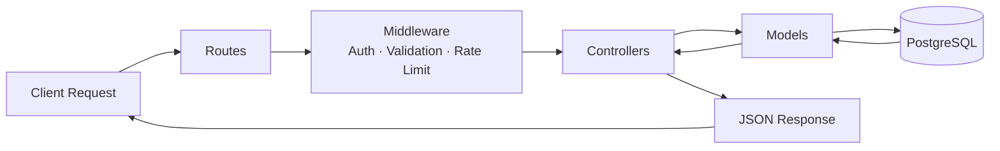
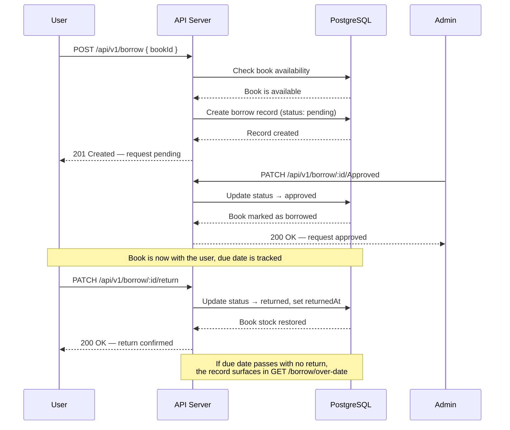

# 📚 Library Management System — Backend API

<p align="left">
  
  
  
  
  
  
</p>

> A production-style REST API for running a library end to end — accounts, catalog, borrowing workflow, and admin reporting — built with a clean MVC architecture.

---

## Table of Contents

1. [Description](#1-description)
2. [Key Features](#2-key-features)
3. [Tech Stack](#3-tech-stack)
4. [Architecture](#4-architecture)
5. [The Borrow Request Journey](#5-the-borrow-request-journey)
6. [Getting Started](#6-getting-started)
7. [Usage](#7-usage)
8. [Main API Routes](#8-main-api-routes)
9. [Project Structure](#9-project-structure)
10. [Contributing](#10-contributing)
11. [License](#11-license)
12. [Contact](#12-contact)

---

## 1. Description

**Library Management System** is a complete REST API for managing a library, built with **Node.js**, **Express**, and **PostgreSQL**.

It replaces manual, spreadsheet-driven library administration with a single automated system that handles:

- 👤 User registration and login, including **Google OAuth** sign-in
- 📖 Book and category management (add, update, delete, bulk import from Excel files)
- 🔄 Borrow request workflows and returns, with automatic overdue tracking
- 📊 An admin statistics dashboard for monitoring library activity

The system follows a clear **MVC** architecture (`Routes → Middleware → Controllers → Models`) with full interactive API documentation via **Swagger**, so every endpoint can be explored and tested directly from the browser.

---

## 2. Key Features

| Feature | Description |
|---|---|
| 🔐 **Secure authentication** | Password hashing with `bcrypt`, Google OAuth login, and JWT-based sessions |
| 🛡️ **Role-based access control** | Separate permissions for `user` and `admin` via custom authorization middleware |
| 📚 **Full book management** | List, search, add, update, delete, and bulk-import books from an Excel file |
| 🗂️ **Category management** | Organize the catalog into categories for faster browsing |
| 🔁 **Complete borrow lifecycle** | Submit a request → admin approval/rejection → return handling → overdue tracking |
| 📈 **Admin statistics dashboard** | Real-time view of active borrows, overdue counts, and catalog health |
| 🚦 **Abuse protection** | Dedicated rate limiting on auth routes and general routes |
| 📄 **Interactive documentation** | Swagger UI for testing every endpoint directly from the browser |

---

## 3. Tech Stack

| Category | Technology |
|---|---|
| Runtime | Node.js (v18+) |
| Framework | Express 5 |
| Database | PostgreSQL (`pg`) |
| Authentication | JWT (`jsonwebtoken`) + `bcrypt` + `google-auth-library` |
| Input validation | `express-validator` |
| File upload/import | `multer` + `xlsx` |
| Documentation | `swagger-jsdoc` + `swagger-ui-express` |
| Security | `express-rate-limit`, `cors` |
| Logging | `pino`, `pino-http`, `pino-pretty`, `morgan` |
| Dev tools | `nodemon`, `dotenv` |

---

## 4. Architecture

The API follows a layered **MVC** flow. Every incoming request passes through the same pipeline before reaching business logic:



- **Routes** — define the URL surface and map it to controllers
- **Middleware** — JWT verification, role checks, `express-validator` schemas, and rate limiting run before any controller logic
- **Controllers** — orchestrate the request, call models, and shape the response
- **Models** — the only layer that talks directly to PostgreSQL

---

## 5. The Borrow Request Journey

The borrow workflow is the heart of the system. Here's how a book moves from *request* to *returned*:



**Status flow at a glance:**

```
pending ──► approved ──► returned
   │
   └──► rejected
```

| Status | Triggered by | Effect |
|---|---|---|
| `pending` | User submits a borrow request | Book is reserved but not yet handed out |
| `approved` | Admin approves the request | Book is marked as borrowed, due date starts |
| `rejected` | Admin rejects the request | Reservation is released, book stays available |
| `returned` | User (or admin) marks the book as returned | Stock is restored, borrow record closed |
| *(overdue)* | Due date passes with no return | Surfaces automatically in `GET /borrow/over-date` — not a stored status, but a computed view |

---

## 6. Getting Started

### Prerequisites

- [Node.js](https://nodejs.org/) version 18 or later
- [PostgreSQL](https://www.postgresql.org/) installed and running, locally or on a server
- A [Google Cloud Console](https://console.cloud.google.com/) project to obtain a `GOOGLE_CLIENT_ID` (needed for Google sign-in)

### Installation

```bash
# 1. Clone the repository
git clone https://github.com/ahmed12334567/Library-Management.git

# 2. Move into the backend folder
cd Library-Management/Back-end/src

# 3. Install dependencies
npm install

# 4. Create your env file from the template
cp .env.example .env
```

Then open `.env` and fill in your connection details:

```env
PORT=3000
DB_PORT=5432
DB_HOST=localhost
DB_USER=your_db_user
DB_PASSWORD=your_db_password
DB_NAME=library_db
JWT_SECRET=your_jwt_secret
GOOGLE_CLIENT_ID=your_google_client_id
```

```bash
# 5. Create the database tables (schema.sql is in src/database)
psql -U your_db_user -d library_db -f database/schema.sql

# 6. Run the server in development mode
npx nodemon server.js

# or run it in production mode
npm start
```

Once running, the server listens by default on:

```
http://localhost:3000
```

---

## 7. Usage

Once the server is running, every endpoint can be explored and tested through the interactive **Swagger** UI at:

```
http://localhost:3000/api-docs
```

### Quick usage examples

**Register a new user**

```bash
curl -X POST http://localhost:3000/api/v1/auth/register \
  -H "Content-Type: application/json" \
  -d '{"name": "Ahmed Ali", "email": "ahmed@example.com", "password": "StrongPass123"}'
```

**Log in and get a JWT**

```bash
curl -X POST http://localhost:3000/api/v1/auth/login \
  -H "Content-Type: application/json" \
  -d '{"email": "ahmed@example.com", "password": "StrongPass123"}'
```

**List all books**

```bash
curl http://localhost:3000/api/v1/books
```

**Submit a borrow request (with an auth token)**

```bash
curl -X POST http://localhost:3000/api/v1/borrow \
  -H "Authorization: Bearer <your_jwt_token>" \
  -H "Content-Type: application/json" \
  -d '{"bookId": 1}'
```

**Approve a borrow request (admin)**

```bash
curl -X PATCH http://localhost:3000/api/v1/borrow/1/Approved \
  -H "Authorization: Bearer <admin_jwt_token>"
```

---

## 8. Main API Routes

| Method | Endpoint | Description | Access |
|---|---|---|---|
| `POST` | `/api/v1/auth/register` | Register a new user | Public |
| `POST` | `/api/v1/auth/login` | Log in | Public |
| `POST` | `/api/v1/auth/google` | Sign in via Google | Public |
| `GET`  | `/api/v1/auth/me` | Get the current user's profile | Authenticated |
| `GET`  | `/api/v1/books` | List all books | Public |
| `POST` | `/api/v1/books` | Add a book | Admin |
| `POST` | `/api/v1/books/import-file` | Bulk-import books from Excel | Admin |
| `GET`  | `/api/v1/categories` | List categories | Admin |
| `POST` | `/api/v1/borrow` | Submit a borrow request | Authenticated |
| `PATCH`| `/api/v1/borrow/:id/Approved` | Approve a borrow request | Admin |
| `PATCH`| `/api/v1/borrow/:id/return` | Mark a book as returned | Authenticated |
| `GET`  | `/api/v1/borrow/over-date` | List overdue books | Admin |
| `GET`  | `/api/v1/dashboard/statistics` | Get dashboard statistics | Admin |

> The full, detailed list of routes — with request/response schemas and example payloads — is available in the Swagger UI.

---

## 9. Project Structure

```
Back-end/src/
├── controllers/     # Request orchestration & response shaping
├── models/          # Database queries (PostgreSQL)
├── routes/          # Endpoint definitions
├── middleware/      # Auth, validation, rate limiting
├── database/        # schema.sql and migrations
├── config/          # Environment & third-party config (Google OAuth, etc.)
├── docs/            # Swagger definitions
└── server.js         # Application entry point
```

---

## 10. Contributing

Contributions are welcome. To add a change or a new feature:

1. Fork the repository.
2. Create a new branch for your feature:
   ```bash
   git checkout -b feature/amazing-feature
   ```
3. Make your changes and commit them:
   ```bash
   git commit -m "Add: amazing feature"
   ```
4. Push the branch to your fork:
   ```bash
   git push origin feature/amazing-feature
   ```
5. Open a **Pull Request** with a clear description of the change.

Please follow the existing code structure (Controllers/Models/Middleware) when adding new features.

---

## 11. License

This project is licensed under the **ISC License**.

---

## 12. Contact

**Ahmed**
GitHub: [@ahmed12334567](https://github.com/ahmed12334567)
Project link: [Library-Management](https://github.com/ahmed12334567/Library-Management)
